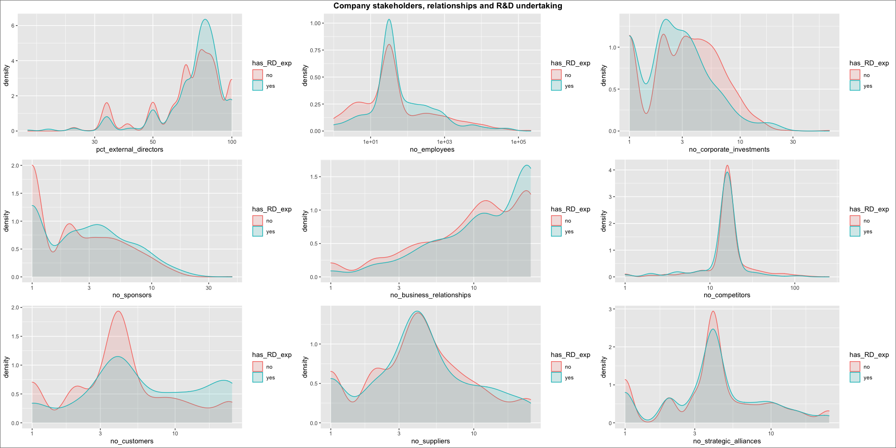
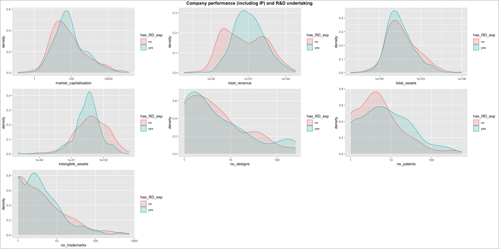

What factors explain ASX companies’ decision to undertake R\&D
activities? A machine learning approach
================
Edgar Brea
31/10/2020

<style type="text/css">
.main-container {
  max-width: 85%;
  margin-left: auto;
  margin-right: auto;
}
</style>

## 1\. Why study R\&D activities?

Here, I investigate what drives a company to spend and undertake
research and development (R\&D) activities. R\&D expenditure is a
recurrent topic in discussions about innovation in Australia, given the
nation’s moderate levels of R\&D intensity [compared to similar
countries](https://data.oecd.org/rd/gross-domestic-spending-on-r-d.htm).
There are two main sides underlying these discussions: one side argues
for [boosting R\&D
activities](https://www.afr.com/companies/business-rd-spend-must-increase-to-cut-technology-gap-20180812-h13v70)
to stimulate the generation of novel products/services; the other argues
that R\&D activities only covers a portion of the entire innovation
activities in an economy, and that we are better off [boosting non-R\&D
activities](https://www.innovationaus.com/does-innovation-need-a-non-rd-focus/)
to stimulate novel offerings.

The solution to this tension is likely to lie between the two. For some
companies, R\&D is a vital component of the innovation process. For
others, R\&D activities are not the most optimal way to innovate.
However, to understand this, we must have a more definitive
understanding of who is doing R\&D in Australia and why.

To bridge this knowledge gap, I develop multiple classification models
with a battery of company variables from ASX-listed companies to predict
the extent to which a company undertakes R\&D activities. The accuracy
of each model is assessed, as well as the list of most important
features for each model, in order to identify the key factors driving
R\&D undertaking.

## 2\. Data and variables

The data was collected from three different datasets: S\&P’s Capital IQ,
Morningstar’s DatAnalyis, and IP Australia’s IPGOD. To maximise the
coverage of company data, R\&D expenditure values, as well as a range of
organisational and financial indicators, were sourced from both Capital
IQ and DatAnalysis and aggregated into a single dataset. Patents,
trademarks and design data were then integrated into the dataset using a
combination of fuzzy name matching and company ABN. After integrating
the three data sources, my final sample was **1387 ** companies that are
either currently listed or were listed at some point in the past.

The following table lists the variables (predictors) developed and used
for the classification models. It also includes a dichotomous variable
indicating whether or not the company reported R\&D expenditures in any
of the last three years (the outcome variable). These variables were
selected after a review of relevant academic literature on corporate
R\&D and strategic management.

``` r
kable(describe(data))
```

|                                 | vars |    n |         mean |           sd |      median |      trimmed |        mad |         min |       max |     range |        skew |    kurtosis |           se |
| :------------------------------ | ---: | ---: | -----------: | -----------: | ----------: | -----------: | ---------: | ----------: | --------: | --------: | ----------: | ----------: | -----------: |
| ticker\*                        |    1 | 1387 |  694.0000000 | 4.005367e+02 |  694.000000 |  694.0000000 | 514.462200 |    1.000000 |    1387.0 |    1386.0 |   0.0000000 | \-1.2025958 |   10.7548439 |
| company\_name\*                 |    2 | 1387 |  694.0000000 | 4.005367e+02 |  694.000000 |  694.0000000 | 514.462200 |    1.000000 |    1387.0 |    1386.0 |   0.0000000 | \-1.2025958 |   10.7548439 |
| ABN\*                           |    3 | 1387 |  693.1824081 | 3.996539e+02 |  694.000000 |  693.2853285 | 512.979600 |    1.000000 |    1384.0 |    1383.0 | \-0.0021396 | \-1.2016739 |   10.7311389 |
| business\_description\*         |    4 | 1387 |  694.0000000 | 4.005367e+02 |  694.000000 |  694.0000000 | 514.462200 |    1.000000 |    1387.0 |    1386.0 |   0.0000000 | \-1.2025958 |   10.7548439 |
| trading\_status\*               |    5 | 1387 |    2.9257390 | 2.730712e-01 |    3.000000 |    3.0000000 |   0.000000 |    1.000000 |       3.0 |       2.0 | \-3.6613905 |  13.1848840 |    0.0073323 |
| company\_status\*               |    6 | 1387 |    2.0519106 | 2.376266e-01 |    2.000000 |    2.0000000 |   0.000000 |    1.000000 |       4.0 |       3.0 |   4.4930192 |  22.1814044 |    0.0063805 |
| country\_of\_incorporation\*    |    7 | 1387 |    1.0273973 | 1.632969e-01 |    1.000000 |    1.0000000 |   0.000000 |    1.000000 |       2.0 |       1.0 |   5.7840904 |  31.4783987 |    0.0043847 |
| headquarters\_city\*            |    8 | 1387 |  196.6683490 | 8.590309e+01 |  208.000000 |  205.7668767 |  85.990800 |    1.000000 |     302.0 |     301.0 | \-0.7728700 | \-0.5148393 |    2.3065909 |
| headquarters\_state\*           |    9 | 1387 |    6.2321557 | 2.920946e+00 |    8.000000 |    6.4185419 |   1.482600 |    1.000000 |       9.0 |       8.0 | \-0.5064902 | \-1.4651933 |    0.0784305 |
| headquarters\_country\*         |   10 | 1387 |    1.0346071 | 1.828484e-01 |    1.000000 |    1.0000000 |   0.000000 |    1.000000 |       2.0 |       1.0 |   5.0868097 |  23.8928605 |    0.0049097 |
| no\_geographic\_segments        |   11 | 1387 |    2.0151406 | 1.916113e+00 |    1.000000 |    1.5841584 |   0.000000 |    1.000000 |      19.0 |      18.0 |   3.2239594 |  15.3850767 |    0.0514497 |
| primary\_industry\*             |   12 | 1387 |   57.2126893 | 3.659888e+01 |   45.000000 |   54.6579658 |  35.582400 |    1.000000 |     137.0 |     136.0 |   0.5307780 | \-0.8432416 |    0.9827194 |
| GICS\_sector\*                  |   13 | 1387 |    6.6647441 | 2.619593e+00 |    7.000000 |    6.9360936 |   2.965200 |    1.000000 |      11.0 |      10.0 | \-0.6135100 | \-0.7950801 |    0.0703389 |
| GICS\_industry\_group\*         |   14 | 1387 |   12.5544340 | 5.114324e+00 |   14.000000 |   12.6372637 |   4.447800 |    1.000000 |      24.0 |      23.0 | \-0.1676416 | \-0.4823004 |    0.1373251 |
| GICS\_industry\*                |   15 | 1387 |   37.9250180 | 1.577283e+01 |   46.000000 |   39.0351035 |   8.895600 |    1.000000 |      66.0 |      65.0 | \-0.6957283 | \-0.7035707 |    0.4235176 |
| year\_founded                   |   16 | 1387 | 1991.4390771 | 2.874634e+01 | 2000.000000 | 1997.4797480 |  10.378200 | 1817.000000 |    2020.0 |     203.0 | \-3.0176919 |  10.5398807 |    0.7718702 |
| ASX\_listing\_year              |   17 | 1387 | 2001.9329488 | 1.336638e+01 | 2005.000000 | 2003.5040504 |  10.378200 | 1885.000000 |    2020.0 |     135.0 | \-1.9366158 |   8.1045081 |    0.3589016 |
| no\_business\_segments          |   18 | 1387 |    2.5818313 | 2.683048e+00 |    1.000000 |    2.0045005 |   0.000000 |    1.000000 |      25.0 |      24.0 |   2.8292692 |  12.1476523 |    0.0720427 |
| pct\_external\_directors        |   19 | 1387 |   72.1888464 | 1.929793e+01 |   75.000000 |   73.8982808 |  12.350058 |    0.000000 |     100.0 |     100.0 | \-0.8846479 |   0.9153692 |    0.5181703 |
| no\_employees                   |   20 | 1387 | 1363.4181687 | 9.874289e+03 |   32.000000 |  109.3267327 |  40.030200 |    0.000000 |  217000.0 |  217000.0 |  16.7851779 | 336.5368781 |  265.1353268 |
| market\_capitalisation          |   21 | 1387 | 1308.1833888 | 7.437476e+03 |   51.065809 |  160.0949210 |  63.837763 |    0.128263 |  134670.9 |  134670.8 |  11.8075302 | 169.2407139 |  199.7042610 |
| total\_revenue                  |   22 | 1387 |  670.4267977 | 3.860641e+03 |    2.850464 |   54.9747032 |   4.226097 | \-42.101000 |   63850.0 |   63892.1 |  11.5099131 | 163.1198928 |  103.6623891 |
| total\_assets                   |   23 | 1387 | 4267.5353311 | 5.146816e+04 |   28.302921 |  145.8290219 |  37.972588 |    0.008000 | 1014060.0 | 1014060.0 |  17.5617697 | 317.9114900 | 1381.9756451 |
| intangible\_assets              |   24 | 1387 |  113.2225884 | 9.172999e+02 |    0.000000 |    3.4967767 |   0.000000 |    0.000000 |   25940.0 |   25940.0 |  19.2300782 | 479.6826627 |   24.6304946 |
| no\_designs                     |   25 | 1387 |    1.0511896 | 1.207478e+01 |    0.000000 |    0.0000000 |   0.000000 |    0.000000 |     251.0 |     251.0 |  15.6904638 | 264.4125215 |    0.3242210 |
| no\_patents                     |   26 | 1387 |    3.8464311 | 2.634925e+01 |    0.000000 |    0.1836184 |   0.000000 |    0.000000 |     566.0 |     566.0 |  13.4783105 | 222.2241803 |    0.7075059 |
| no\_trademarks                  |   27 | 1387 |    4.6236482 | 3.393999e+01 |    0.000000 |    0.4275428 |   0.000000 |    0.000000 |     745.0 |     745.0 |  14.7753680 | 257.2173061 |    0.9113255 |
| no\_corporate\_investments      |   28 | 1387 |    3.3100216 | 3.576487e+00 |    2.000000 |    2.7848785 |   1.482600 |    0.000000 |      64.0 |      64.0 |   4.9075035 |  62.5808992 |    0.0960326 |
| no\_sponsors                    |   29 | 1387 |    3.4131218 | 3.395554e+00 |    2.000000 |    2.7398740 |   1.482600 |    1.000000 |      47.0 |      46.0 |   3.0857192 |  22.0892280 |    0.0911743 |
| no\_industries\_associated      |   30 | 1387 |    9.7087239 | 6.360180e+00 |    8.000000 |    8.6849685 |   5.930400 |    2.000000 |      57.0 |      55.0 |   2.0036828 |   6.5652500 |    0.1707777 |
| no\_products                    |   31 | 1387 |    3.8904110 | 1.543815e+00 |    5.000000 |    4.0576058 |   0.000000 |    1.000000 |      13.0 |      12.0 | \-0.4550165 |   0.1908420 |    0.0414531 |
| no\_business\_relationships     |   32 | 1387 |   13.3280461 | 8.292181e+00 |   12.000000 |   13.3186319 |  10.378200 |    1.000000 |      25.0 |      24.0 |   0.1943857 | \-1.3668602 |    0.2226540 |
| no\_competitors                 |   33 | 1387 |   18.8211968 | 1.691020e+01 |   16.000000 |   16.0819082 |   0.000000 |    1.000000 |     254.0 |     253.0 |   5.6446047 |  46.9564381 |    0.4540573 |
| no\_customers                   |   34 | 1387 |    6.8759913 | 6.923029e+00 |    4.000000 |    5.4374437 |   2.965200 |    1.000000 |      25.0 |      24.0 |   1.6416600 |   1.5184286 |    0.1858908 |
| no\_suppliers                   |   35 | 1387 |    6.0814708 | 5.882924e+00 |    4.000000 |    4.8514851 |   2.965200 |    1.000000 |      25.0 |      24.0 |   1.9317810 |   3.2288133 |    0.1579629 |
| no\_strategic\_alliances        |   36 | 1387 |    5.6128335 | 5.214663e+00 |    4.000000 |    4.5562556 |   2.965200 |    1.000000 |      25.0 |      24.0 |   2.1839454 |   4.7848863 |    0.1400193 |
| no\_competitors\_na             |   37 | 1387 |    0.6532084 | 4.761204e-01 |    1.000000 |    0.6912691 |   0.000000 |    0.000000 |       1.0 |       1.0 | \-0.6431058 | \-1.5875579 |    0.0127843 |
| no\_strategic\_alliances\_na    |   38 | 1387 |    0.2891132 | 4.535141e-01 |    0.000000 |    0.2367237 |   0.000000 |    0.000000 |       1.0 |       1.0 |   0.9293416 | \-1.1371425 |    0.0121773 |
| no\_employees\_na               |   39 | 1387 |    0.2790195 | 4.486789e-01 |    0.000000 |    0.2241224 |   0.000000 |    0.000000 |       1.0 |       1.0 |   0.9843174 | \-1.0318617 |    0.0120475 |
| no\_customers\_na               |   40 | 1387 |    0.2472963 | 4.315961e-01 |    0.000000 |    0.1845185 |   0.000000 |    0.000000 |       1.0 |       1.0 |   1.1701751 | \-0.6311437 |    0.0115888 |
| year\_founded\_na               |   41 | 1387 |    0.1427541 | 3.499481e-01 |    0.000000 |    0.0540054 |   0.000000 |    0.000000 |       1.0 |       1.0 |   2.0402354 |   2.1641225 |    0.0093965 |
| no\_suppliers\_na               |   42 | 1387 |    0.1398702 | 3.469774e-01 |    0.000000 |    0.0504050 |   0.000000 |    0.000000 |       1.0 |       1.0 |   2.0743143 |   2.3044427 |    0.0093167 |
| no\_geographic\_segments\_na    |   43 | 1387 |    0.1369863 | 3.439569e-01 |    0.000000 |    0.0468047 |   0.000000 |    0.000000 |       1.0 |       1.0 |   2.1092874 |   2.4508617 |    0.0092356 |
| intangible\_assets\_na          |   44 | 1387 |    0.0713771 | 2.575465e-01 |    0.000000 |    0.0000000 |   0.000000 |    0.000000 |       1.0 |       1.0 |   3.3261090 |   9.0695417 |    0.0069154 |
| no\_business\_relationships\_na |   45 | 1387 |    0.0540735 | 2.262443e-01 |    0.000000 |    0.0000000 |   0.000000 |    0.000000 |       1.0 |       1.0 |   3.9391481 |  13.5266414 |    0.0060749 |
| no\_products\_na                |   46 | 1387 |    0.0353280 | 1.846742e-01 |    0.000000 |    0.0000000 |   0.000000 |    0.000000 |       1.0 |       1.0 |   5.0287144 |  23.3047728 |    0.0049587 |
| no\_business\_segments\_na      |   47 | 1387 |    0.0216294 | 1.455227e-01 |    0.000000 |    0.0000000 |   0.000000 |    0.000000 |       1.0 |       1.0 |   6.5697754 |  41.1916493 |    0.0039074 |
| total\_revenue\_na              |   48 | 1387 |    0.0115357 | 1.068215e-01 |    0.000000 |    0.0000000 |   0.000000 |    0.000000 |       1.0 |       1.0 |   9.1388328 |  81.5770814 |    0.0028683 |
| pct\_external\_directors\_na    |   49 | 1387 |    0.0036049 | 5.995410e-02 |    0.000000 |    0.0000000 |   0.000000 |    0.000000 |       1.0 |       1.0 |  16.5472211 | 272.0066398 |    0.0016098 |
| has\_RD\_exp\*                  |   50 | 1387 |    1.2667628 | 4.424269e-01 |    1.000000 |    1.2088209 |   0.000000 |    1.000000 |       2.0 |       1.0 |   1.0535935 | \-0.8905812 |    0.0118796 |

## 3\. Exploratory analysis

The following figures show the bivariate relationships between the
predictors and R\&D undertaking, organised in three groups:

  - Company characteristics (e.g. industry, age, size, geographic
    segments)
  - Company stakeholders and relationships (e.g. internal such as
    employees, percentage of external directors; and external such as
    customers and suppliers)
  - Company performance and IP data (e.g. revenue, market
    capitalisation, patents)

<!-- --><!-- --><!-- -->
Regarding company characteristics, we can see that companies
incorporated and/or headquartered outside Australia are slightly more
likely to undertake R\&D. There is also some differences across states
in which companies are headquartered. The biggest differences can be
seen across GICS (Global Industry Classification Standard) sectors and
industries. Also, companies with larger number of geographic segments
are slightly more likely to undertake R\&D. So, **the industry of
operation and internationalisation emerge as potential key predictors**,
confirming what the theory says about R\&D expenditure.

Regarding stakeholder variables, companies with more customers and
business relationships are more likely to undertake R\&D. In principle,
this confirms theory, which suggest that **greater relationships with
customers and suppliers are key drivers of R\&D activities**. Companies
with less investments in other companies and more sponsors
(i.e. companies investing in them) are more likely to undertake R\&D,
suggesting that **R\&D-intensive companies are more likely to be
supported by - rather than provide support to - external
organisations**. Also, a **greater percentage of external directors
seems to have a relationship with R\&D undertaking**, which aligns with
the insights from company characteristic predictors.

As for company performance, **companies with R\&D show a greater market
capitalisation**, which confirms both theoretical and practical
knowledge on the topic. Also, firms with R\&D are more likely to have a
moderate revenue and intangible assets, thus, **there is a sweet spot in
terms of revenues and intangibles that favour R\&D undertaking**.
Lastly, **companies with more design, patents an trademarks seem to be
more likely to undertake R\&D**.

Let’s see if these insights hold when building the predictive models.

## 4\. Building the classifiers

Three classification models were developed in order to predict whether
or not a company undertakes R\&D. Random forest, logistic regression,
and naive Bayes methods were used to build the three classifiers. These
three are among the most widely-used machine learning methods within the
data science community.

Firstly, I build the training set to train the classifier, and the
testing set to evaluate its performance:

``` r
set.seed(1234) #for reproducibility

#Build training and testing sets:
data_ready <- data[,-c(1:4,8,12,15)] #remove firm metadata and categorical variables with extreme number of categories

sample_size <- floor(0.75 * nrow(data_ready)) #size of training dataset = 75% of data
train_indices <- sample(nrow(data_ready), size = sample_size) #obtain list of indices for training dataset
train_data <- data_ready[train_indices, ] #build training dataset
test_data <- data_ready[-train_indices, ] #build testing dataset
```

Then, I train and test each model, and assess how important each
predictor is for the model:

### Random forest-based classifier:

``` r
rf_model1 <- randomForest::randomForest(has_RD_exp ~., data = train_data, ntree = 5000) #build model using 5000 trees

#calculate accuracy with testing set:
pred <- predict(rf_model1, newdata = test_data[,!(names(test_data) == "has_RD_exp")]) #use model to predict labels
cm <- table(test_data$has_RD_exp, pred) #confusion matrix using true outcome vs predicted outcome
rf_model1_acc <- sum(diag(cm)) / (sum(cm)) * 100 #the cases predicted correctly, divided by total cases
```

<!-- -->

**Result**: The model accuracy is **85.01%**. Consistent with the
exploratory analysis and past literature, the industry predictors are
the most dominant. Interestingly, the amount of intangibles, revenue,
assets, market capitalisation and patents are also important predictors
of R\&D.

### Logistic regression-based classifier:

``` r
lr_model1 <- glm(has_RD_exp ~., data = train_data, family = "binomial") %>%
  MASS::stepAIC(trace = FALSE) # performs stepwise variable selection

#calculate accuracy with testing set:
pred2 <- predict(lr_model1, newdata = test_data[,!(names(test_data) == "has_RD_exp")]) #use model to predict labels
pred_classes2 <- ifelse(pred2 > 0.5, "yes", "no") #turn predictions from continuous [0,1] to dichotomous
cm2 <- table(test_data$has_RD_exp, pred_classes2) #confusion matrix using true outcome vs predicted outcome
lr_model1_acc <- sum(diag(cm2)) / (sum(cm2)) * 100 #the cases predicted correctly, divided by total cases
```

<!-- -->

**Result**: The model accuracy is **84.44%**. Similar to the random
forest classifier, the industry variables are the most dominant
predictors of R\&D undertaking. The number of patents and revenue are
also important predictors (similar to random forest). Interestingly, the
number of geographic segments, the age and number of strategic alliances
emerge as important predictors in this model.

### Naive Bayes-based classifier:

``` r
nb_model1 <- caret::train(x = as.data.frame(train_data[,!(names(train_data) == "has_RD_exp")]),
                          y = train_data$has_RD_exp,
                          method = "naive_bayes",
                          preProcess=c("scale","center"),
                          trControl = trainControl(method = 'cv', number = 10))

#calculate accuracy with testing set:
pred3 <- predict(nb_model1, newdata = test_data[,!(names(test_data) == "has_RD_exp")]) #predict labels in test set using model built
cm3 <- table(test_data$has_RD_exp, pred3) #confusion matrix using true outcome vs predicted outcome
nb_model1_acc <- sum(diag(cm3)) / (sum(cm3)) * 100 #the cases predicted correctly, divided by total cases
```

<!-- -->

**Result**: The model accuracy is **80.69%**. The most interesting
insight about this classifier is that the industry is not the most
dominant factor, but rather the intangible and number of patents.
Revenue, trademarks and number of customers are close seconds.

## 5\. Model comparison:

When comparing the accuracy of each model, the random forest classifier
emerge as the highest performer. However, the performance of the
logistic regression classifier was very close. Let’s look at the ROC
(receiver operating characteristic) curve and corresponding AUC (area
under the curve) of each classifier to assess performance further:

<!-- -->

## 6\. Discussion:

From the curve, it becomes clear the superiority of both the random
forest and logistic regression classifiers compared to the naive Bayes
classifier. **The random forest classifier has a greater AUC**, and it
can be seen that it **performs better than the logistic regression
classifier** in the middle section of the curves (where the false
positive rates are between 0.1 and 0.6).

Considering the superiority of the random forest classifier, we go back
to its most important predictors in order to establish a definitive
answer to our research question. Unarguably, **the industry in which the
company operates is a dominant feature driving R\&D undertaking**. This
insight suggest that Australia’s R\&D intensity is a reflection of the
industry structure underpinning the economy. In fact, if we go back to
the exploratory analysis, we see that Materials, Energy and Diversified
Financials industries (the three most populous industries in Australia)
show comparatively low counts of companies with R\&D.

When we consider the top 10 predictors (excluding GICS industry group
and sector), interesting insights emerge too. **The amount of intangible
assets, total revenue and total assets all play a role in predicting
R\&D undertaking**. The curves from the exploratory analysis indicate a
group of companies heavy in assets (inc. intangibles) and revenues that
do not undertake R\&D. This can be interpreted in three ways: they
outsource innovation activities to other organisations, undertake other
forms of innovation, or do not innovate. More research covering non-R\&D
innovation activities might be needed to better understand this
situation.

Next, we have market capitalisation and number of patents. **Companies
with more patents and greater market capitalisation are more likely to
undertake R\&D**. This aligns with the majority of academic research
arguing that R\&D outputs are typically protected through patents, and
that the market values R\&D intensity (as well as patents). However,
this might be due the lack of reliable metrics for non-R\&D innovation,
which forces the market to rely on R\&D and patents.

The remaining three features in the top 10 predictors are \*\*
headquarter state, number of employees and year founded\*\*. The
difference in the headquarter state may be attributable to the uneven
location of businesses depending on the industry (i.e. mining and
resource industries are more likely to be located in some states than
others). With number of employees, we can see a large number of
companies with 0-1 employees not undertaking R\&D. These are likely to
be junior mining companies, which have a greater focus on exploration
and new discoveries than on R\&D. Lastly, there is a group of relatively
young companies that are less likely to undertake R\&D, suggesting that
these are companies that are still focusing on developing
product/service lines and business processes, before committing to
further R\&D expenditures.

There are also important insights regarding the features in the bottom
of the importance ranking. The company and trading status of the
companies in my sample, as well as features such as number of products,
segments, competitors and number of alliances are less likely to play a
role in R\&D undertaking.

## 7\. Conclusions:

This study shows that **whether or not a company undertakes R\&D can be
predicted using a battery of company structural and performance
features**. In regards to the factors driving R\&D undertaking in
Australia, a random forest-based classification model indicate that
**the industry in which the company operates is the most dominant factor
influencing R\&D**. The amount of **assets, revenues, market
capitalisation and number of patents play a secondary, although a
noticeable, role as well**.
